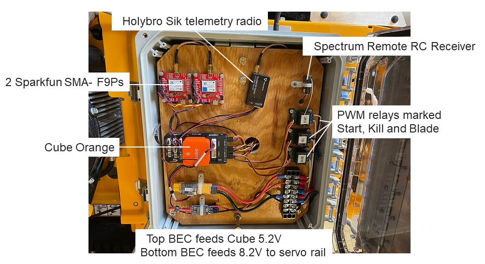
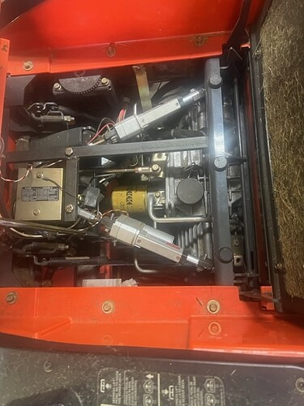

.. _mower-hardware: 

========================
Hardware Recommendations
========================

This page lists proven hardware options and combinations for use on Rover mowers.

Autopilots
==========

Cube Orange or Mateksys H743 is widely used on mowers.

Many of the mowers out there use the Cube Orange and they have all the processing power and memory that the mower requires. The Mateksys H743 series have VERY similar processor and memory specs as the Orange Cube and Orange+. What you give up with the Mateksys boards is heated/vibration damped IMUs (not super important features for the mower application) and the convenient form factor of the Cubes. You actually gain a UART or two with the Mateksys autopilot. A good compromise might be the ZealotH743, which is packaged into a very nice enclosure at a lower price point than the Cubes.
Some users have used other autopilots for the mower application as well, but the Cube Orange and the Mateksys H743 allow advanced control capabilities using scripts as well as room to store 700 waypoints for complex mowing plans.  Other autopilots may not have the same capabilities.

GPS Hardware
============

Two SimpleRTK2B GPS boards or other  ZED-F9P GPS boards such as Sparkfun SMA- F9Ps are needed for the mower.  One board is the GPS for the mower determining the mower's position and the other board takes a second offset position reading and the two known locations allow the autopilot to calculate the heading for the mower (aka Moving Base or GPS for Yaw).  It provides a heading reference that is FAR more reliable and accurate than a magnetometer (compass).  The Ardusimple 3B Heading boards will also work fine. It’s just hard to justify the cost over two Zed-F9P based modules.
IT IS NOT RECOMMENDED TO USE THE SIMPLERTK2B+HEADING KIT FROM ARDUSIMPLE FOR USE WITH ARDUPILOT!
It can be made to work, but it will take extra effort to install it and to manually configure everything after software updates on Ardupilot.  The Ardupilot automatic configuration process works with the other ZED-F9P GPS boards and makes it less work for the user.
It is also recommended that survey grade dual band GPS antennas are used on both GPS boards.  They have a signal gain of about 5db compared to 2db for the small “Black Puck” GNSS Dual Band antenna that come with the RTK starter kits. The small low gain antennas will work and a lot of people use them, but the higher gain antennas will help when cloud cover or other factors reduce the signal.  

Radio Control
=============

Selecting a radio transmitter is difficult because a large number of them will work just fine and everyone has personal preferences and a budget they want to stay within.  It is recommended that you get a radio and receiver that has at least 10 channels.
Here are a few that people are using: RadioMaster TX16S, FLYSKY FS-I6X with a 10 Channel receiver.

Telemetry
=========

mRo SiK Telemetry Radio
Holybro Sik telemetry radio
RFD900 telemetry radio
Along with many others

The telemetry link from your ground station running Mission Planner to the mower is essential.  All communication from your ground station computer to the mower Autopilot goes through this link.  It is not recommended to use WIFI instead of a radio for telemetry on a mower application.  All of these radios operate in the Frequency Range:  902 - 928 MHz (USA) / 915 - 928 MHz (Australia).  Both the mRo and the Holybro radios transmit 100mw and the RFD 900 radio transmits 1w and is a little more of a long-range option.

Servos
======
Users have had success with the AGFRC 100KG servo and the HiTec D845WP servos when used on  the very common HydroGear transaxle that is used on many mowers. The drive servos are selected based on the amount of force that is needed to move the hydraulic control valve on the mower platform.  If you have a mower platform that is different you will have to determine what servo will work by researching what others have used and/or measuring the torque required.  There is a resistance spring on most of the hydraulic control valves that needs to be removed to reduce the torque required by the servo.  The resistance springs are only needed when driving with the manual drive handles.  The manual drive handles are disconnected when the servos are connected.  Manual drive handle operation is not compatible with the electronic drive system.  The new manual operation is now to flip a switch on the RC controller and drive with the joysticks.  The AGFRC 100KG servo is a bigger more robust solution, having more torque and operating at 12v and can be powered directly from the mower’s battery.  The HiTec D845WP is a 45KG servo operating at a lower voltage (5-8v), but requires a separate lower voltage power supply.  Both of these servos are Waterproof - Metal Gear servos for use in harsh environments.

Typical Electronic Interconnect Diagram
========================================

.. image:: ../images/mower_diagram.png
    :target: ../_images/mower_diagram.png

Typical Mower Electronics enclosure
=====================================

Modifications to the mower platform
=================================================

Drive Servo Mounting
-----------------------------
It is a multi-dimensional puzzle to figure out where to mount the drive servos. They need to be in a serviceable location, protected from the other moving parts and heat sources, be very firmly mounted, as well as being in the right place to get the movement needed.  This will likely require building custom mounting hardware and linkages. 

Servo Mounting for Various Models
------------------------------------------------

.. image:: ../images/mower-Yuri_servo_mounting_2022_2.jpeg
    :target: ../_images/mower-Yuri_servo_mounting_2022_2.jpeg
The model of Yuri's mower?

.. image:: ../images/mower-Hustler_Raptor%20mower_servo_setup.jpeg
    :target: ../_images/mower-Hustler_Raptor%20mower_servo_setup.jpeg
Servo and Linkage mounting on Hustler Raptor SD

Linear Actuators mounted on a Kubota ZD326 Diesel mower

We need more representative pictures of servo/linear actuators (especially at least a few that show AGFRC servos
I can scale the images to make them smaller and all the same size.

Other Hardware to allow remote operation
----------------------------------------------------------

Hardware is needed to automate the engine throttle, mower deck blade control, and carburetor choke.  Every builder usually implements some safety shutdown switches to stop operation quickly.  A good approach is to put enough safe guards in place so you, “the builder”, feel comfortable doing the task at hand.  Automated equipment can be dangerous if you are not in control even when it is running on its own. Most builders have a manual emergency ignition switch on the mower and a remote-controlled ignition switch on the engine driven mowers.  Most of these added on controls use the RC transmitter to control PWM relays mounted on the mower.  Some builders use completely separate radios for the safety shutdown system   The PWM relays control the additional smaller servos or the switching to turn systems on or off. This part of the build gets very customized and every interface to these mower platforms is different.  Some common parts often used are as follows:

.. image:: ../images/mower-CZH_Labs_SPDT_8channel_PWM_relay_Model_D-228_V2.png
    :target: ../_images/mower-CZH_Labs_SPDT_8channel_PWM_relay_Model_D-228_V2.png
Picture of CZH_Labs SPDT 8channel PWMR Relay Model_D-228

.. image:: ../images/mower-servo_cam-over_on_throttle2.png
    :target: ../_images/mower-servo_cam-over_on_throttle2.png
Picture of Servo Cam-over on throttle linkage

The cam-over technique takes all the rotational load off a servo in the run position.

Additional Hardware??
=====================

