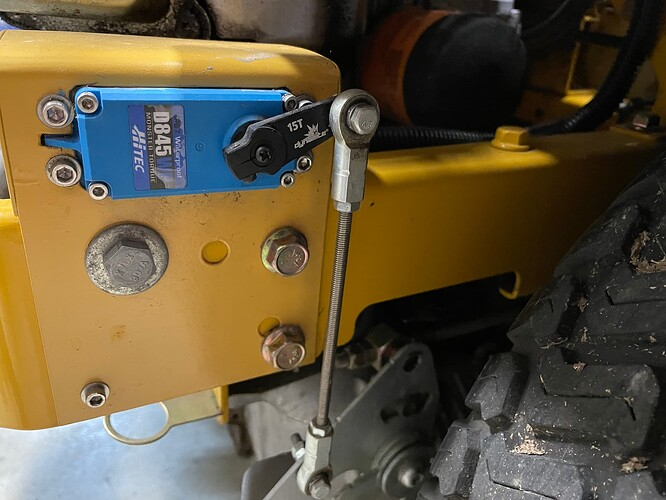

.. _mower-hardware: 

==============================
Mower Hardware Recommendations
==============================

This page lists proven hardware options and combinations for use on Rover mowers.

Autopilots
==========

Many of the mowers out there use the Cube Orange and they have all the processing power and memory that the mower requires. The Mateksys H743 and the Holybro Kakute H743 Wing series have VERY similar processor and memory specs as the Cube Orange. What you give up with the Mateksys or Holybro boards are heated/vibration damped IMUs (not important features for the mower application) and the convenient form factor of the Cubes. You actually gain a UART or two with the Mateksys autopilot. A good compromise is the ZealotH743, which is packaged into a very nice enclosure at a lower price point than the Cubes.
Some users have used other autopilots for the mower application as well, but the Cube Orange, the Mateksys H743, and the Holybro Kakute H743 Wing allow advanced control capabilities using scripts as well as room to store 700 waypoints for complex mowing plans.  Some users have also migrated to high end flight controllers like the CUAV V6X or the the  Holybro Pixhawk 6 to have Ethernet/Wifi communications as an option instead of radios.  Having Ethernet lets the user easily use Wifi for telemetry and/or online NTRIP  RTK correction data.  There is no one size fits all autopilot and many other autopilots may have the capabilities you need as a user.

GPS Hardware
============

There are a lot of acceptable RTK GPS units out there that will work but devices based on Ublox F9P chips or devices based on the Unicore UM-982 or some dual-antenna devices can be used to estimate heading angle.  Cost and functionality tend to lead users to SimpleRTK2B GPS boards or other ZED-F9P GPS boards such as Sparkfun SMA- F9Ps. The F9P boards slightly outperform the UM-982 boards, but they both work well on the mowers. It typically requires two GPS boards, unless a dual antenna device is selected.  One board is for determining the mower's GPS position and the other board takes a second offset position reading and the two known locations allow the autopilot to calculate the heading angle for the mower (aka Moving Base or GPS for Yaw). It provides a heading reference that is FAR more reliable and accurate than a magnetometer (compass). IT IS NOT RECOMMENDED TO USE THE SIMPLERTK2B+HEADING KIT FROM ARDUSIMPLE FOR USE WITH ARDUPILOT! It can be made to work, but it will take extra effort to install it and to manually configure everything. It is also recommended that survey grade dual band GPS antennas are used on both GPS boards. They have a signal gain of about 5db compared to 2db for the small “Black Puck” u-blox GNSS Multiband antenna. The small low gain antennas will work and a lot of people use them, but the higher gain antennas will help when cloud cover or other factors reduce the signal.

RC Transmitter/Receiver
=============

Selecting an RC transmitter is difficult because a large number of them will work just fine and everyone has personal preferences and a budget they want to stay within. It is recommended that you get a radio and receiver that has at least 10 channels. Here are a few that people are using: RadioMaster TX16S, and some that stay with the less expensive FLYSKY FS-I6X with a 10 Channel receiver.  The FLYSKY FS-I6X is actually a 6 channel system that will support 10 channels (if a 10 channel receiver is used).  These are very different units. One cost more and provides more capability, including advance communication protocols, two way communication to get information back from the flight controller, and advanced information display.  The other approach with the less expensive unit is one way communication, basic control function, and no advanced information display.  

Telemetry
=========

The telemetry link from your ground station running Mission Planner to the mower is essential. All communication from your ground station computer to the mower Autopilot goes through this link. All of these radios in the US operate in the Frequency Range: 902 - 928 MHz (USA) / 915 - 928 MHz (Australia).  Both the mRo and the Holybro radios transmit 100mw and the RFD 900x radio transmits 1w and is a little more of a long-range option. 
Wifi is now also becoming an option for mower telemetry. The Halow Wifi point to point range extender has become has also become a viable option allowing Wi-Fi access and moves the user away from the radio links.  Technically the range extender sends an RF link out to the Halow unit on the mower with a built-in 900 Mhz radio, but to the user it’s a Wi-Fi hotspot on the mower with an extended range.
Here is a list of popular options:
•	mRo SiK Telemetry Radio
•	Holybro Sik telemetry radio
•	RFD900x telemetry radio
•	Halow Wifi Extender

Servos
======

Users have had success with many servos including HAPPYMODEL 400kg, AGFRC 125KG, and HiTec D845WP servos. The AGRFC servos run on 12v which makes them popular on mowers. The drive servos are selected based on the amount of force that is needed to move the hydraulic control valve on the mower platform. You will have to determine what servo will work by researching what others have used and/or measuring the torque required. Whatever force is required select a servo rated for at least double or triple the required torque, so they will be under less stress and last longer. There is a “centering” spring on most of the hydraulic control valves that needs to be removed to reduce the torque required by the servo. The manual drive handles are disconnected when the servos are connected. Manual drive handle operation is not compatible with the electronic drive system. The new manual operation is now to flip a switch on the RC controller and drive with the joysticks. The Happymodel 400KG servos operate at 24v and require a separate power supply. The AGFRC 125KG servo is a robust solution, having more torque and operating at 12v being powered directly from the mower’s battery. The HiTec D845WP is a 45KG servo operating at a lower voltage (3.5-8.4v), but requires a separate lower voltage power supply. All of these servos are Waterproof - Metal Gear servos for use in harsh environments.

Typical Mower Electronics Enclosure
====================================

.. image:: ../images/mower-electronics.png
    :target: ../_images/mower-electronics.png

Modifications to the Mower Platform
===================================

Drive Servo Mounting
====================

It is a multi-dimensional puzzle to figure out where to mount the drive servos. They need to be in a serviceable location, protected from the other moving parts and heat sources, be very firmly mounted, as well as being in the right place to get the movement needed.  This will likely require building custom mounting hardware and linkages. 

Servo Mounting for Various Models
=================================

2012 ExMark Pioneer

Servo and Linkage mounting on Hustler Raptor SD

(image missing)
TODO:  Need to add a picture  Linear Actuators mounted on a Kubota ZD326 Diesel mower

Other Hardware to Allow Remote Operation
========================================

Hardware is needed to automate the engine throttle, mower deck blade control, and carburetor choke.  Every builder usually implements some safety shutdown switches to stop operation quickly.  A good approach is to put enough safe guards in place so you, “the builder”, feel comfortable doing the task at hand.  Automated equipment can be dangerous if you are not in control even when it is running on its own. Most builders have a manual emergency ignition switch on the mower and a remote-controlled ignition switch on the engine driven mowers.  Most of these added on controls use the RC transmitter to control PWM relays mounted on the mower.  Some builders use completely separate radios for the safety shutdown system   The PWM relays control the additional smaller servos or the switching to turn systems on or off. This part of the build gets very customized and every interface to these mower platforms is different.  A common part often used is a PWM controlled relay bank like the one shown here.  There are numerous options for this type of equipment

Picture of CZH_Labs SPDT 8channel PWMR Relay Model_D-228

