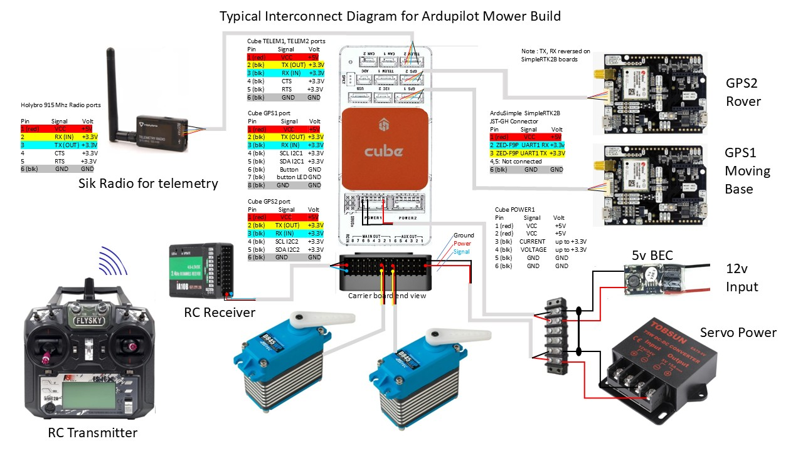

.. _mower-ztr_overview: 

===========================
Autonomous Zero Turn Mowers
===========================

Combustion engined zero turn mowers are a popular choice for conversion to autonomous operation. They are most commonly used to mow large lawns or fields but have been converted to carry or tow agricultural sprayers, weed wipers, and other equipment.

Basic Hardware Layout
=====================

The flight controller (the Cube Orange in this case) is the processor controlling the drive aspects of the machine.  It is gathers information from the systems around it, like the GPS systems so it can perform autonomous control when commanded to do so.  These are the basic systems of any Ardupilot rover.

Additional Configuration
========================

A mower or a tractor or mower needs specialized additional control.  These controls are added by using the RC Transmitter switches, variable rate dials, and joy-sticks, to control things directly or indirectly by passing through the FC.   Most signal pass through the FC so the processor can in certain situations take actions.  The situations vary depending on the requirements, but often relays and other control equipment are added.

Some of these functions are as follows:

- Arming the vehicle (enabling the FC (Flight Controller) to do risky operations – like moving a big machine
- Remotely switching drive modes (example going from manual RC control to AUTO)
- Remote engine starting
- Arming the vehicle (enabling the FC to do risky operations – like moving a big machine
- Remotely turning off the engine
- Activating PTO (power take off) systems to turn on blade etc.
- Remotely marking GPS positions of the machine out in the field
- Remotely turning on other equipment like lights and cameras

In summary it means that for a mower you need an RC transmitter/reviver capable of at least 10 channels, the more the better.

